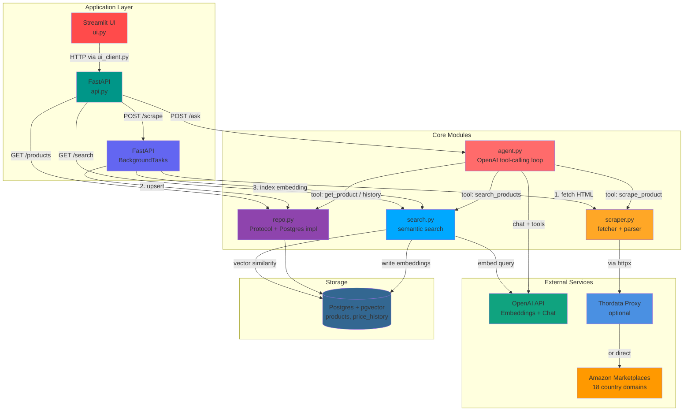
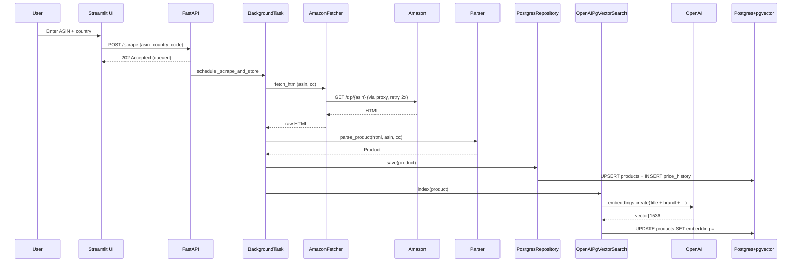
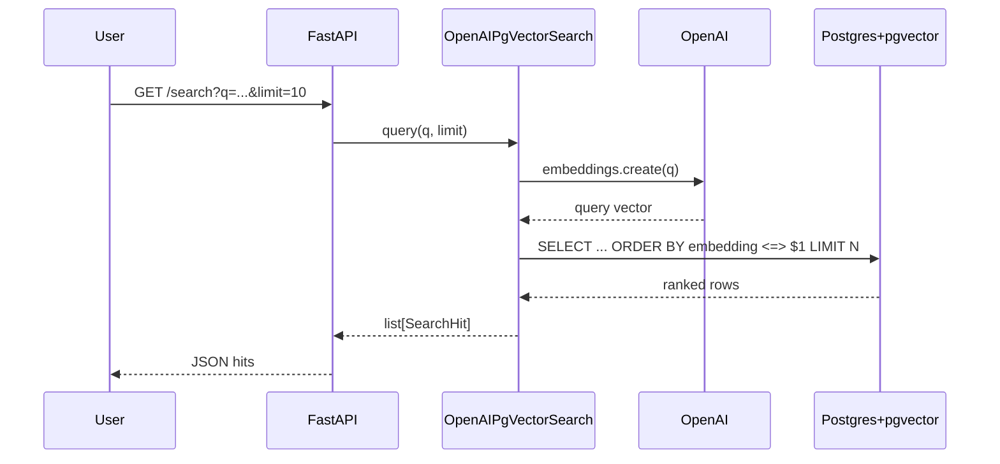
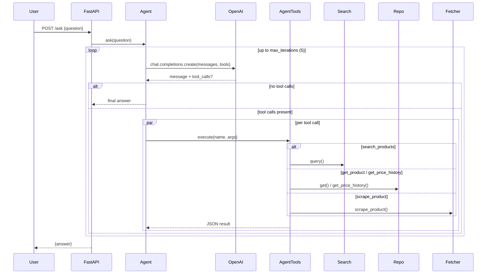

# Amazon Scraper — Architecture

## System Architecture

## Data Flow Diagrams

### Scrape Flow (`POST /scrape`)

### Semantic Search Flow (`GET /search`)

### Agent Q&A Flow (`POST /ask`)

## Key Components

| Component      | Technology              | Purpose                                                           |
|----------------|-------------------------|-------------------------------------------------------------------|
| **UI**         | Streamlit               | Browser frontend (`ui.py` + `ui_client.py` HTTP client)          |
| **API**        | FastAPI + uvicorn       | REST endpoints, factory + lifespan wiring                         |
| **Background** | FastAPI BackgroundTasks | In-process async jobs for `/scrape` (no external queue)           |
| **Fetcher**    | httpx (async)           | Amazon HTML retrieval, retries, proxy support, 18 marketplaces   |
| **Parser**     | BeautifulSoup4 + lxml   | HTML → `Product` domain object; currency/price normalization      |
| **Repo**       | SQLAlchemy async        | `ProductRepository` Protocol; `InMemory` + `Postgres` adapters    |
| **Database**   | Postgres 16 + pgvector  | Products, price history, 1536-dim embeddings in one store         |
| **Search**     | OpenAI + pgvector       | `text-embedding-3-small` + cosine similarity via `<=>` operator   |
| **Agent**      | OpenAI tool-calling     | `gpt-4o-mini` loop; dispatches to repo/search/scraper tools       |
| **Migrations** | Alembic                 | `0001_initial`, `0002_add_embedding`                              |
| **Config**     | Pydantic Settings       | `.env`-driven; DB URL, OpenAI key, proxy URL                      |

## Technology Stack

- **Backend**: Python 3.13, FastAPI, uvicorn, SQLAlchemy (async), asyncpg
- **Database**: Postgres 16 + pgvector extension
- **AI/ML**: OpenAI SDK (`AsyncOpenAI`) — `text-embedding-3-small` (1536d), `gpt-4o-mini`
- **Scraping**: httpx (async, retries, proxy), BeautifulSoup4, lxml
- **UI**: Streamlit
- **Migrations**: Alembic
- **Validation**: Pydantic (Decimal prices, ISO country codes, ASIN regex)
- **Testing**: pytest, pytest-asyncio, testcontainers (pgvector integration tests)
- **Infra**: Docker Compose (Postgres + pgvector)

## Architectural Choices

- **No external queue** (Inngest/Celery/RQ). `BackgroundTasks` is enough for a single-process personal tool. Trade-off: tasks die with the process — swap in Arq/RQ if durability matters. See [api.py](src/new_amazon_scraper/api.py) header.
- **One datastore, not two.** pgvector stores embeddings alongside product rows — no MongoDB + Qdrant split. Fewer moving parts, transactional consistency for free.
- **No LangChain.** Direct OpenAI tool-calling loop in [agent.py](src/new_amazon_scraper/agent.py). Thin, testable, no framework churn.
- **Protocol-based adapters.** `ProductRepository`, `HtmlFetcher`, `Search` are `typing.Protocol`s. In-memory doubles make unit tests trivial; production wiring lives only in `create_production_app()`.
- **Factory + lifespan split.** `create_app()` composes dependencies for tests; `create_production_app()` owns resource lifecycle (engine, HTTP client, OpenAI client).
