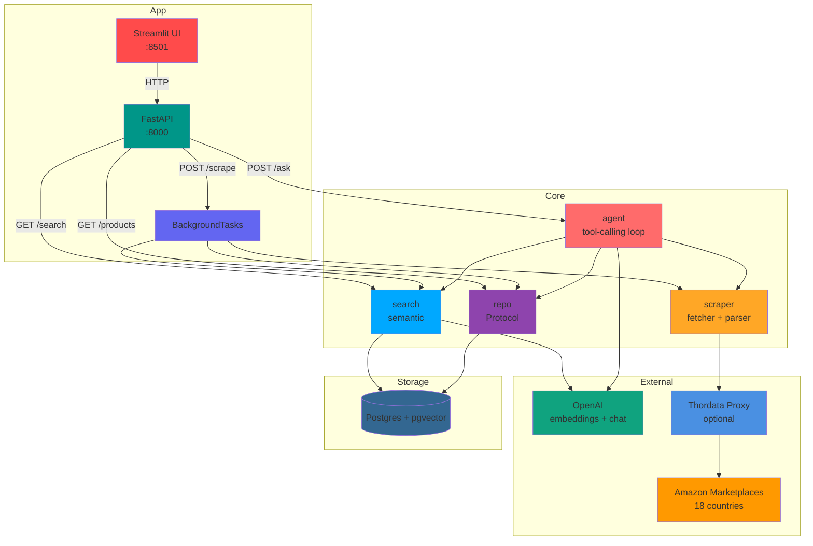

# Amazon Scraper

Async Python service that scrapes Amazon product pages across 18 marketplaces, stores price history in Postgres, indexes products as vector embeddings with **pgvector**, and answers natural-language questions through an **OpenAI tool-calling agent**.

FastAPI backend, Streamlit frontend, clean Protocol-based adapters, real integration tests with `testcontainers`.

---

## Quickstart

```bash
# 1. Install deps (uv)
uv sync

# 2. Start Postgres + pgvector
docker compose up -d

# 3. Configure secrets
cp .env.example .env
# then edit .env: OPENAI_API_KEY, THORDATA_* (optional proxy)

# 4. Run migrations
uv run alembic upgrade head

# 5. Start the API
uv run uvicorn new_amazon_scraper.api:create_production_app --factory --reload

# 6. Start the UI (separate terminal)
uv run streamlit run src/new_amazon_scraper/ui.py
```

API at `http://localhost:8000`, UI at `http://localhost:8501`.

---

## Architecture



Full diagrams (scrape flow, search flow, agent loop) in [ARCHITECTURE.md](ARCHITECTURE.md).

---

## Features

- **Multi-region scraping** — 18 Amazon marketplaces (US, DE, UK, JP, IN, …) keyed by ISO country code
- **Price history** — every scrape appends a `price_history` row; chart over time
- **Semantic search** — `text-embedding-3-small` (1536 dims) + pgvector cosine similarity
- **Agent Q&A** — OpenAI tool-calling loop over `search_products`, `get_product`, `get_price_history`, `scrape_product`
- **EU decimal-comma prices** — "1.299,99 €" parsed correctly alongside "$1,299.99"
- **Proxy support** — optional Thordata proxy for rate-limit resilience
- **Retries** — exponential backoff on 5xx / network errors in [fetcher.py](src/new_amazon_scraper/fetcher.py)
- **Atomic upsert** — products + price history in one transaction
- **Protocol-based adapters** — swap in-memory doubles for tests, real Postgres for prod

---

## API

| Method | Path                                              | Description                              |
|--------|---------------------------------------------------|------------------------------------------|
| GET    | `/health`                                         | Liveness check                           |
| POST   | `/scrape`                                         | Queue background scrape (202 Accepted)   |
| GET    | `/products?limit=100`                             | List stored products                     |
| GET    | `/products/{asin}/{country_code}`                 | Fetch one product                        |
| GET    | `/products/{asin}/{country_code}/history`         | Price history (newest first)             |
| GET    | `/search?q=...&limit=10`                          | Vector similarity search                 |
| POST   | `/ask`                                            | LLM agent answers a natural-language Q   |

### Example

```bash
# Scrape a product
curl -X POST http://localhost:8000/scrape \
  -H "Content-Type: application/json" \
  -d '{"asin": "B08N5WRWNW", "country_code": "US"}'

# Ask the agent
curl -X POST http://localhost:8000/ask \
  -H "Content-Type: application/json" \
  -d '{"question": "What is the cheapest Echo device?"}'
```

---

## Project Layout

```
src/new_amazon_scraper/
  product.py      # Domain model (Product, PricePoint) — zero deps
  fetcher.py      # httpx async client, retries, 18-marketplace domain map
  parser.py       # BeautifulSoup HTML → Product
  scraper.py      # fetcher + parser composition
  db.py           # SQLAlchemy ORM + pgvector column
  repo.py         # ProductRepository Protocol + InMemory + Postgres impls
  search.py       # OpenAI embeddings + pgvector cosine search
  agent.py        # OpenAI tool-calling loop (AgentTools + Agent)
  api.py          # FastAPI factory + lifespan, BackgroundTasks
  config.py       # Pydantic Settings from .env
  ui.py           # Streamlit frontend
  ui_client.py    # Typed HTTP client for the UI

alembic/          # Migrations (0001 initial, 0002 add embedding)
tests/            # Unit + integration (testcontainers)
```

---

## Tech Stack

**Backend** Python 3.12+, FastAPI, uvicorn, SQLAlchemy (async), asyncpg
**AI** OpenAI SDK — `text-embedding-3-small` + `gpt-4o-mini`
**Storage** Postgres 16 + pgvector
**Scraping** httpx (async, retries, proxy), BeautifulSoup4, lxml
**UI** Streamlit
**Validation** Pydantic v2 (Decimal prices, ISO codes, ASIN regex)
**Tooling** Alembic, ruff, pytest, pytest-asyncio, testcontainers, uv

---

## Configuration

All settings read from `.env` via Pydantic `Settings`. See [.env.example](.env.example).

| Variable                      | Purpose                                   |
|-------------------------------|-------------------------------------------|
| `DATABASE_URL`                | `postgresql+asyncpg://...`                |
| `OPENAI_API_KEY`              | Required for `/search` and `/ask`         |
| `OPENAI_EMBEDDING_MODEL`      | Default `text-embedding-3-small`          |
| `OPENAI_CHAT_MODEL`           | Default `gpt-4o-mini`                     |
| `THORDATA_PROXY_SERVER`       | Optional; bypasses direct Amazon calls    |
| `LOG_LEVEL`                   | `INFO` by default                         |

---

## Testing

```bash
# Unit tests (fast, no docker)
uv run pytest

# Include integration tests (spins up pgvector via testcontainers)
uv run pytest --run-integration
```

Integration tests marked `@pytest.mark.integration` use a real Postgres+pgvector container — no mocks for the database layer.

---

## Design Notes

- **No external queue (Inngest/Celery/RQ).** `BackgroundTasks` is enough for a single-process personal tool. Tasks die with the process — swap in Arq/RQ when durability matters.
- **One datastore, not two.** pgvector stores embeddings alongside product rows. No MongoDB + Qdrant split — fewer moving parts, transactional consistency.
- **No LangChain.** Direct OpenAI tool-calling in [agent.py](src/new_amazon_scraper/agent.py). Thin, testable, no framework churn.
- **Factory + lifespan split.** `create_app()` composes deps for tests; `create_production_app()` owns engine / HTTP / OpenAI lifecycles.

See [ARCHITECTURE.md](ARCHITECTURE.md) for sequence diagrams and deeper rationale.
